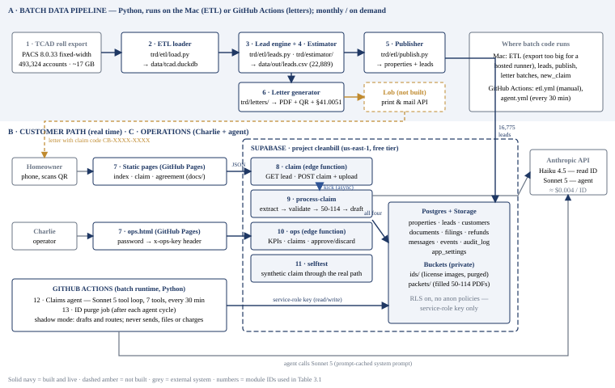
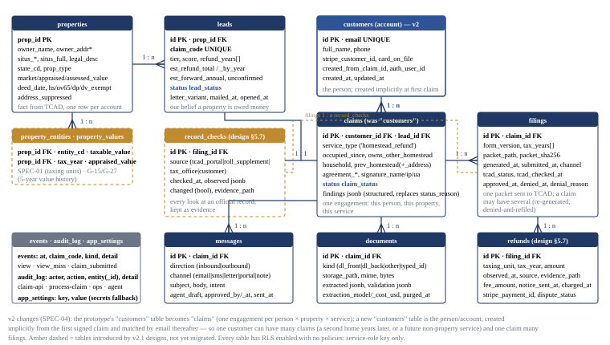
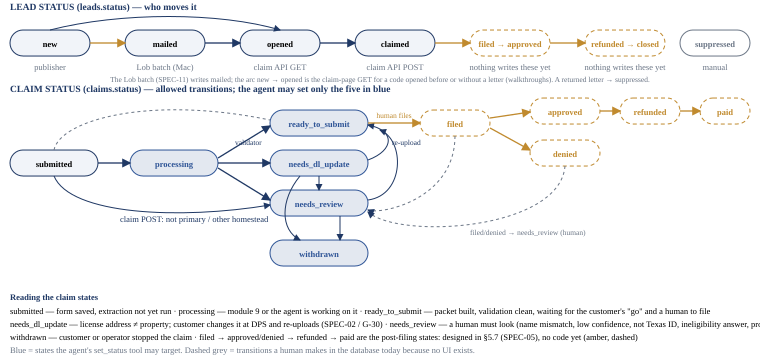
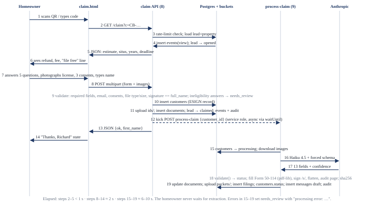
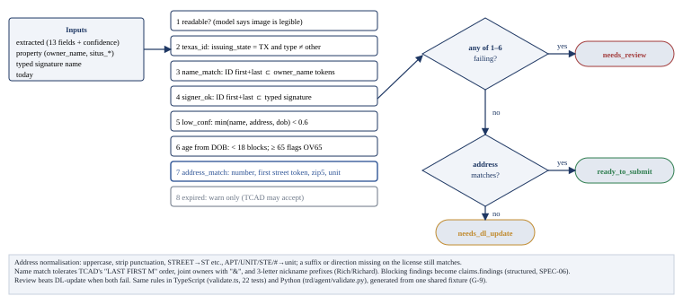
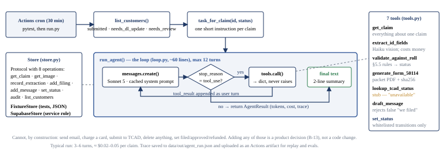
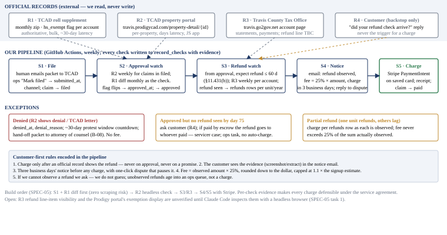

# Texas Refund Desk — Architecture

*Technical reference, extracted from the Product & Engineering Handbook v2.1 (2026-09-12, Cowork project "Texas Refund Desk", `claude/handbook-v2.md`). Sections 3–5 of the handbook: system architecture and module reference, data model v2, process flows. Keep this file current in the same PR as any change to a module, table, flow or status (see CLAUDE.md). Business decisions live in the Cowork project's `claude/decisions.md`; technical decisions in `docs/adr/`. Figures are in `docs/figures/`. Every acronym is defined in the glossary at the end.*

Section 3

## 3. System architecture

The system is three lanes. **Lane A** is a batch data pipeline that turns TCAD's free roll export into a scored lead list and letters; it is plain Python and runs on your Mac or GitHub Actions. **Lane B** is the customer path: a static page a homeowner opens from the letter, backed by a JSON API on Supabase that stores the claim and immediately runs extraction, validation and form filling. **Lane C** is operations: your dashboard, and a scheduled Claude agent that works open claims in shadow mode. Every lane reads and writes the same Postgres database, and nothing but the service-role key can touch it.

#### Why "claim" and "process-claim" are two functions, not one

**`claim` is the front door; `process-claim` is the back office.** `claim` does only cheap, deterministic work — check the code, save the answers, store the photo, record the signature — and answers the homeowner in about two seconds. `process-claim` does the expensive, fallible work — send the photo to Claude, compare the result with the appraisal record, fill and sign the 50-114 — which takes six to ten seconds and can fail (blurry photo, model timeout, TCAD form revision). Splitting them means (1) the submission is safely on disk before anything can go wrong, (2) a processing failure lands the claim in `needs_review` with the photo intact instead of losing the customer, and (3) processing can be re-run on the same submission (re-upload, re-extract, regenerate packet) without asking the customer to fill the form again. With inline validation (SPEC-06) the page will *wait* for `process-claim` and show the result immediately — the split stays; only the page's behaviour changes.

**Figure 3.1 — System architecture.** Module numbers match Table 3.1. The only runtime services are GitHub Pages, Supabase, GitHub Actions and the Anthropic API; there is no server of our own.

### 3.1 Module reference

"Module" here means a unit of code with one job, one place it runs and one set of inputs/outputs. Status: **Built** works and is verified · **Partial** works with a known defect or missing piece · **Gap** does not exist.

<table class="wide" style="width:100%;">
<colgroup>
<col style="width: 16%" />
<col style="width: 16%" />
<col style="width: 16%" />
<col style="width: 16%" />
<col style="width: 16%" />
<col style="width: 16%" />
</colgroup>
<thead>
<tr class="header">
<th class="c" style="width: 4%">#</th>
<th style="width: 12%">Module</th>
<th style="width: 11%">Runs on / tech</th>
<th style="width: 15%">Path</th>
<th style="width: 49%">What it does — inputs → outputs</th>
<th class="c" style="width: 9%">Status</th>
</tr>
</thead>
<tbody>
<tr class="odd">
<td class="c">1</td>
<td>TCAD roll export</td>
<td>External · zip of fixed-width text files</td>
<td class="mono">data/raw/ (Mac)</td>
<td>TCAD's certified appraisal roll, published free each July with monthly supplements, in the "PACS Appraisal Export 8.0.33" layout (the format of the appraisal software TCAD runs). Files used: <code>APPRAISAL_INFO</code> (one row per account: owner, mailing address, situs, values, exemption flags, deed date) and <code>PROP_ENT</code> (one row per account × taxing unit — cut to <code>PROP_ENT_slim</code>, 3.13M rows, loaded as <code>appraisal_entity_info</code>, SPEC-01). ~17 GB unzipped.</td>
<td class="c">**External**</td>
</tr>
<tr class="even">
<td class="c">2</td>
<td>ETL loader</td>
<td>Python · DuckDB</td>
<td class="mono">trd/etl/load.py 
trd/etl/layouts/*.json</td>
<td>Reads the zip with a layout spec (column name, start, width, type) and writes a DuckDB table <code>appraisal_info</code>. A "slim" spec cuts the export to the ~40 columns we need so the file fits in memory. Input: export zip + layout JSON → output: <code>data/tcad.duckdb</code>.</td>
<td class="c">**Built**</td>
</tr>
<tr class="odd">
<td class="c">3</td>
<td>Lead engine</td>
<td>Python · pandas</td>
<td class="mono">trd/etl/leads.py</td>
<td>Selects leads from the roll (heuristic in §5.1), assigns a tier by deed date, calls the estimator per lead, mints a claim code, builds <code>situs_full</code>. Input: DuckDB + as-of date → output: <code>data/out/leads.csv</code> and a summary JSON (counts by tier and value band).</td>
<td class="c">**Built**</td>
</tr>
<tr class="even">
<td class="c">4</td>
<td>Refund estimator</td>
<td>Python (pure)</td>
<td class="mono">trd/estimator/refund.py 
trd/estimator/rates.py</td>
<td>Encodes the Tax Code rules: refundable years (§11.431 two-year look-back), per-unit exemption rules (school state amount plus any local-option percentage; local percentage with $5,000 floor or flat amount; none), OV65 stacking, conservative rounding. Input: appraised value, filing date, deed date, <strong>the property's TCAD entity codes</strong> → output: <code>RefundEstimate</code> (years, by-year savings by unit, total, forward annual, unconfirmed flag, unit names for the letter). The rate table is data: <code>rates/units.json</code>, one entry per Travis County taxing unit (254 codes, 146 taxing) × tax year 2024–2026, generated by <code>build_units.py</code> from the county's truth-in-taxation rate summary, TCAD's exemption listing and a cross-check against the certified roll (ADR 0014). A figure is <em>confirmed</em> when it comes from a source for that year, from statute, or can only understate; anything carried back from the 2026 listing that could overstate is unconfirmed and marks the lead. Without entity codes the five Austin units are assumed and the estimate is flagged unconfirmed.</td>
<td class="c">**Built**</td>
</tr>
<tr class="odd">
<td class="c">5</td>
<td>Publisher</td>
<td>Python · supabase-py</td>
<td class="mono">trd/etl/publish.py</td>
<td>Upserts <code>properties</code> and inserts <code>leads</code> from the CSV; idempotent on <code>prop_id</code> (existing leads are never overwritten, so claim codes stay stable across re-runs). Can emit batched SQL instead when there is no network.</td>
<td class="c">**Built**</td>
</tr>
<tr class="even">
<td class="c">6</td>
<td>Letter generator</td>
<td>Python · reportlab · qrcode</td>
<td class="mono">trd/letters/generate.py 
copy/letter_variant_*.md</td>
<td>Renders a one-page Letter-size PDF per lead: 14-pt bold §41.0051 disclaimer, refund math rounded down to $100, the taxing units that owe the refund, "file free yourself" line, QR + short URL with the claim code, A/B variants. Lob-ready format. No send path yet.</td>
<td class="c">**Partial**</td>
</tr>
<tr class="odd">
<td class="c">7</td>
<td>Customer web app (Next.js on Vercel, T-12) · static fallback pages</td>
<td>Vercel · Next.js 16 App Router · TypeScript · Tailwind (GitHub Pages · HTML/JS for the fallback)</td>
<td class="mono">apps/web/src/app/(site)/{page,pricing,how-it-works,faq,exemptions,appeals,businesses,about,claim,agreement,app}/… apps/web/src/app/(flow)/claim/[code]/page.tsx apps/web/src/app/(portal)/claim/[code]/status/page.tsx apps/web/src/components/*.tsx apps/web/src/lib/{api,copy,site,status,format,heic}.ts docs/{index,claim,agreement,ops}.html (fallback)</td>
<td><strong>apps/web</strong> (SPEC-04b, SPEC-06b, SPEC-02 §1, <strong>SPEC-07</strong>; ADR 0017, ADR 0018). <strong>SPEC-07 site (2026-09-16):</strong> the "Clean Bill" redesign — DM Sans, teal/navy tokens in <code>globals.css</code>, one <code>BRAND</code> token; marketing pages <code>/</code> (hero with the address-or-code card), <code>/pricing</code>, <code>/how-it-works</code>, <code>/faq</code>, <code>/exemptions</code>, <code>/appeals</code>, <code>/businesses</code>, <code>/about</code>; <code>/claim</code> the claim-code entry (default → not found → confirm the property → <code>/claim/[code]</code>; "Sign in" and <code>/app</code> land here because the code is the credential); every address / business form posts <code>POST /claim/inquiry</code> (lead capture answered by e-mail — no address lookup, ADR 0018). <code>/claim/[code]/status</code> is the portal view: status card with the six-stage progress row and dates, documents, messages (with the reply box), estimate, billing, other properties. <strong>Claim flow:</strong> <code>/claim/[code]</code> runs estimate → 5 eligibility questions → typed pre-check (<code>GET /claim/precheck</code> on blur) + license photo (HEIC converted in the browser) → contact → review &amp; sign → inline result (polls <code>GET /claim?c&amp;claim</code> every 2 s, max 30 s) → card step (rendered only with <code>NEXT_PUBLIC_STRIPE_ENABLED=true</code>, SPEC-03) → done. A claimed code opens the fix screen (<code>needs_dl_update</code>: both addresses, DPS link, one upload → the re-upload path), the review question with a reply box (<code>POST /claim/reply</code>) or the typed confirmation form, or the ready screen with the packet link. <code>/claim/[code]/status</code> and <code>/agreement/[code]</code>. Reads only <code>NEXT_PUBLIC_*</code>; all wording in <code>lib/copy.ts</code> from <code>copy/*.md</code>. Smoke test <code>eval/web_smoke.py --base &lt;url&gt;</code>. <strong>Fallback:</strong> the four static pages in <code>docs/</code> are frozen (bug fixes only) until cut-over (Task 6), then retired per ADR 0012; <code>ops.html</code> stays until ops moves behind auth.</td>
<td class="c">**Built** (preview) · cut-over pending</td>
</tr>
<tr class="even">
<td class="c">8</td>
<td>claim API</td>
<td>Supabase Edge Function · Deno/TS · v6 (v7 = SPEC-06a, on merge)</td>
<td class="mono">supabase/functions/claim/ index.ts · logic.ts _shared/findings.ts (generated) _shared/validate.ts</td>
<td>Five routes (table in §5.8). <strong>GET</strong> <code>?c=CODE</code>: normalises the code, rate-limits (120 views/IP/hour via <code>events</code>), loads lead + property, logs a <code>view</code> event, moves lead <code>new/mailed → opened</code>, returns estimate, situs, deadline; for a lead already <code>claimed</code> it also returns the claim's status and rendered findings so the page can show the fix screen (SPEC-02 §1). <strong>GET</strong> <code>?c&amp;claim=&lt;id&gt;</code>: the inline-validation poll — status, findings with <code>customer_message</code> and <code>next_action</code>, a 10-minute packet URL when <code>ready_to_submit</code> (SPEC-06 §2). <strong>GET</strong> <code>/precheck?c&amp;address&amp;zip</code>: <code>addressMatches</code> only, logs <code>typed_precheck</code> (SPEC-06 §3). <strong>POST</strong> <code>/events</code>: funnel events from the page. <strong>POST</strong> multipart: a new claim (validates fields and consents, routes obvious ineligibility to <code>needs_review</code> with rule-table findings, inserts <code>claims</code>, uploads license image(s) to <code>ids/</code>, inserts <code>documents</code> incl. a <code>typed_id</code> row when the pre-check fields came along, marks lead <code>claimed</code>, logs event + audit, kicks module 9) — or, for a code already claimed, the SPEC-02 re-upload (<code>needs_dl_update</code> + <code>dl_front</code> → new document, status <code>processing</code>, re-kick) or the SPEC-06 §4 typed confirmation (<code>needs_review</code> for <code>not_readable</code>/<code>low_confidence</code> + <code>typed_*</code> fields); anything else 409. CORS open (the code is the secret); <code>verify_jwt=false</code>.</td>
<td class="c">**Built**</td>
</tr>
<tr class="odd">
<td class="c">9</td>
<td>process-claim</td>
<td>Supabase Edge Function · Deno/TS · v3</td>
<td class="mono">supabase/functions/process-claim/ 
index.ts · form50114.ts _shared/validate.ts · _shared/findings.ts</td>
<td>Downloads the <strong>newest</strong> <code>dl_front</code> (and a <code>dl_back</code> from the same upload — a SPEC-02 re-upload replaces the old photo), calls Haiku 4.5 with a forced tool schema (<code>record_id_fields</code>) to get 13 fields + per-field confidence; when called with <code>typed_confirmation</code> the newest <code>typed_id</code> document's fields override what the model read (confidence 1.0). Runs the validator (§5.5) — findings are codes + facts rendered through the generated rule table (ADR 0016) — decides the status, fills the official Form 50-114 with pdf-lib (text/checkbox/radio fields, <code>/s/ Name</code> on the signature widget, flattened, audit page appended), uploads to <code>packets/</code>, inserts <code>filings</code>, updates the claim status, writes a templated follow-up <code>messages</code> draft, audit-logs. <code>verify_jwt=true</code> (service role only). Drafts to the customer quote the customer sentences from the rule table.</td>
<td class="c">**Built**</td>
</tr>
<tr class="even">
<td class="c">10</td>
<td>ops API</td>
<td>Supabase Edge Function · Deno/TS · v3</td>
<td class="mono">supabase/functions/ops/</td>
<td>Password check (<code>x-ops-key</code> header or <code>?key=</code>). <strong>GET</strong>: lead counts per status (count queries — a plain select caps at 1,000 rows), page views, last 200 claims joined to lead + property, front-document extraction and findings, latest filing with a 10-minute signed URL to the packet, all messages. <strong>POST</strong> <code>{action: approve|discard, message_id}</code>: approve flips <code>agent_draft=false</code>; discard deletes. Nothing sends.</td>
<td class="c">**Built**</td>
</tr>
<tr class="odd">
<td class="c">11</td>
<td>selftest (end-to-end health check)</td>
<td>Supabase Edge Function · Deno/TS · v2</td>
<td class="mono">supabase/functions/selftest/</td>
<td><strong>This is a test of the real build</strong> — it submits a synthetic claim through the live <code>claim</code> API and waits for the live <code>process-claim</code>, exactly as a homeowner would, then reports pass/fail. It exists because a person cannot click through 30 times a day and because the sandbox cannot reach Supabase from a browser; it is the one-URL health check ("is the whole pipeline working right now?") and it runs after every deploy. Scenarios: <code>match</code> → <code>ready_to_submit</code>; <code>mismatch</code> → <code>needs_dl_update</code>; <code>mismatch_then_fix</code> (SPEC-02) → mismatch, then a matching ID re-uploaded through the real re-upload path → <code>ready_to_submit</code> with a second packet, and a further re-upload refused with 409. Every scenario also probes <code>GET /claim/precheck</code> (match + mismatch, with timing) and the <code>?claim=</code> poll. ~10–25 s. Only ever touches <code>TRD-TEST-0001</code>.</td>
<td class="c">**Built**</td>
</tr>
<tr class="even">
<td class="c">12</td>
<td>Claims agent</td>
<td>GitHub Actions · Python · Sonnet 5</td>
<td class="mono">trd/agent/loop.py · tools.py 
store.py · system_prompt.md 
run.py · validate.py · packet.py 
.github/workflows/agent.yml</td>
<td>On manual dispatch (the 30-minute schedule is disabled until test data exists, ADR 0011): lists customers in <code>submitted / needs_dl_update / needs_review</code>, and for each runs a Messages-API tool loop (max 12 turns) with a prompt-cached system prompt and 7 tools (§5.4). The store abstraction has a fixture backend (tests, no network) and a Supabase backend. Cannot send, file or charge — by construction the tools do not exist. Uploads a JSON trace as an Actions artifact. <strong>Scheduled runs are currently failing</strong> (email alerts) — disable the schedule until test data exists; diagnose in Phase 0 (G-8).</td>
<td class="c">**Failing**</td>
</tr>
<tr class="odd">
<td class="c">13</td>
<td>ID purge job*</td>
<td>GitHub Actions · Python</td>
<td class="mono">trd/jobs/purge_ids.py*</td>
<td>Deletes license images from <code>ids/</code> 30 days after filing, 7 days after withdrawal, or 180 days stale; sets <code>documents.purged_at</code>; audit-logs. Runs <code>--apply</code> at the end of each agent cycle. *On the Mac, not on GitHub.</td>
<td class="c">**Unpushed**</td>
</tr>
<tr class="even">
<td class="c">14</td>
<td>New-claim tool*</td>
<td>Python CLI (Mac)</td>
<td class="mono">trd/ops/new_claim.py*</td>
<td>Creates a claim code for any property in the full roll by address or account (<code>--address / --prop-id</code>, preview then <code>--create</code>); flags already-exempt homes as test-only. Used for friend/self walkthroughs. *On the Mac, not on GitHub; not yet exposed in ops.html.</td>
<td class="c">**Unpushed**</td>
</tr>
<tr class="odd">
<td class="c">15</td>
<td>Tests &amp; evals</td>
<td>pytest · Deno test · Playwright</td>
<td class="mono">tests/ · eval/</td>
<td>28 Python tests on the Mac — 23 on GitHub until the push (estimator, ETL on a synthetic export, validation mirror, agent loop with a scripted fake model, purge rules), 22 Deno tests for <code>validate.ts</code>, a Playwright smoke test that drives index → claim → upload → sign → ops, a 30-image synthetic license eval with a ≥ 95% gate (last run 96.7%).</td>
<td class="c">**Built**</td>
</tr>
<tr class="even">
<td class="c">16</td>
<td>Payments (Stripe)</td>
<td>—</td>
<td>—</td>
<td>Card on file at signature (SetupIntent, SPEC-03); fee charge after an observed refund with notice (SPEC-05). <strong>No code exists.</strong> Schema has the columns.</td>
<td class="c">**Gap**</td>
</tr>
<tr class="odd">
<td class="c">17</td>
<td>Mail (Lob) &amp; email (Resend)</td>
<td>—</td>
<td>—</td>
<td>Sending letters from module 6; sending approved <code>messages</code>; receiving inbound replies. <strong>No code exists.</strong></td>
<td class="c">**Gap**</td>
</tr>
<tr class="even">
<td class="c">18</td>
<td>Filing &amp; post-filing monitoring</td>
<td>GitHub Actions (design)</td>
<td>—</td>
<td>Emailing the packet to TCAD (decision O-01 → email); watching TCAD's roll supplement and property portal for approval; watching the Tax Office account for the refund; notice, then charge. Designed in §5.7 / SPEC-05. <strong>No code exists</strong> beyond the table shapes.</td>
<td class="c">**Gap**</td>
</tr>
</tbody>
</table>

### 3.2 Runtime and environment facts

|                          |                                                                                                                                                                                                                                                                                                                                                                                                                                         |
|--------------------------|-----------------------------------------------------------------------------------------------------------------------------------------------------------------------------------------------------------------------------------------------------------------------------------------------------------------------------------------------------------------------------------------------------------------------------------------|
| Supabase project         | Display name `texas-refund-desk` (renamed 2026-09-13; ref `letrfpwskjbgnyacesgv`, every URL unchanged). us-east-1, free tier. Functions deployed from `main` by `deploy.yml` (2026-09-14: claim v6, process-claim v5, ops v5, selftest v4, all ACTIVE; the next merge deploys SPEC-06a). Shared code lives in `supabase/functions/_shared/` and is bundled into each function that imports it. Per-function `verify_jwt` is recorded in `supabase/config.toml`.                                                                                                                                                                         |
| Deploys                  | Only from `main`, by `.github/workflows/deploy.yml`: `supabase db push` → `supabase functions deploy --use-api` → `supabase db diff --linked` must be empty (ADR 0015). Migration files are named by the hosted version (`supabase_migrations.schema_migrations.version`); `supabase/ci/shim.sql` lets `ci.yml` apply the chain to a plain Postgres. |
| Public URLs              | Customer app: Vercel project `texas-refund-desk` (Root Directory `apps/web`; production from `main`; a preview per branch push at `https://texas-refund-desk-<hash>-ponitz-development.vercel.app`); `https://texasrefunddesk.com` is attached at cut-over (Task 6). Fallback pages: `https://cponitz.github.io/texas-refund-desk/{index,claim,agreement,ops}.html` (GitHub Pages serves `docs/` at the site root). `ops` target: `https://ops.texasrefunddesk.com` behind auth (later). |
| API base                 | `https://letrfpwskjbgnyacesgv.supabase.co/functions/v1/{claim,ops,process-claim,selftest}`                                                                                                                                                                                                                                                                                                                                              |
| Secrets                  | `ANTHROPIC_API_KEY`, `OPS_PASSWORD`: function env first, else `app_settings` table (RLS, service role only). GitHub Actions secrets: `ANTHROPIC_API_KEY`, `SUPABASE_URL`, `SUPABASE_SERVICE_ROLE_KEY`. Local: git-ignored `.env`. Never in a document.                                                                                                                                                                                  |
| Models & cost            | Extraction `claude-haiku-4-5` (\$1/\$5 per Mtok) ≈ \$0.0035–0.0047 per license. Agent `claude-sonnet-5` (\$2/\$10; cache reads 10%), 3–6 turns per claim ≈ \$0.02–0.05.                                                                                                                                                                                                                                                                 |
| Sandbox network (Cowork) | Reachable: api.anthropic.com, \*.supabase.co, comptroller.texas.gov, api.lob.com, api.stripe.com, github.com, PyPI, npm. Blocked: traviscad.org, api.supabase.com (deploys go through the MCP connector), jsr.io. Consequence: ETL runs on the Mac; TCAD lookups will only work from GitHub Actions.                                                                                                                                    |
| Code locations           | GitHub `cponitz/texas-refund-desk` (renamed; tag `v0.1-prototype` marks the prototype) · Mac `~/Desktop/ClaudeCowork/texas-refund-desk/texas-refund-desk/` (the parent folder holds the raw TCAD files and `artifacts/`). Naming rule: the product, the repo, the Supabase project, the Vercel project and the Mac folder are all `texas-refund-desk`; the Python package stays `trd`.                                                                                                      |

### 3.3 Security model (what protects what)

<table class="wide">
<colgroup>
<col style="width: 33%" />
<col style="width: 33%" />
<col style="width: 33%" />
</colgroup>
<thead>
<tr class="header">
<th style="width: 18%">Asset</th>
<th style="width: 60%">Control</th>
<th class="c" style="width: 22%">Status</th>
</tr>
</thead>
<tbody>
<tr class="odd">
<td>Database rows</td>
<td>RLS enabled on every table with no anon/authenticated policies → only the service-role key reads or writes. Pages never hold that key; they only call functions.</td>
<td class="c">**In place**</td>
</tr>
<tr class="even">
<td>A lead's claim page</td>
<td>The claim code (11 chars from a 32-symbol alphabet, ~1.1 × 1012 combinations) is the credential. Rate limit 120 GETs/IP/hour. Misses are logged as <code>view_miss</code>.</td>
<td class="c">**In place**</td>
</tr>
<tr class="odd">
<td>License images</td>
<td>Private bucket <code>ids/</code>; served only by functions; DL number stored masked <code>***1234</code> (§11.48); purge job after filing.</td>
<td class="c">**Purge job unpushed**</td>
</tr>
<tr class="even">
<td>Packets</td>
<td>Private bucket <code>packets/</code>; 10-minute signed URLs from the ops API only.</td>
<td class="c">**In place**</td>
</tr>
<tr class="odd">
<td>Ops dashboard</td>
<td>Single shared password compared in the function; sent as a header, never stored in the page. No lockout, no audit of failed attempts, no second factor.</td>
<td class="c">**Adequate for one operator** 
Password rotated Sep 12. Upgrade to Supabase Auth magic link before a second operator.</td>
</tr>
<tr class="even">
<td>Agent blast radius</td>
<td>Tools cannot send, file, charge or delete; status transitions whitelisted; drafts that claim un-happened actions are rejected; max 12 turns.</td>
<td class="c">**In place**</td>
</tr>
<tr class="odd">
<td>Secrets in code</td>
<td><code>.env</code> git-ignored; example file committed. <code>OPS_PASSWORD</code> rotated Sep 12 (the old value was printed in a Sep 7 task list, now scrubbed); update the <code>.env</code> on the Mac with the value sent in chat.</td>
<td class="c">**Rotated**</td>
</tr>
</tbody>
</table>

Section 4

## 4. Data model v2

The prototype's model had one table doing two jobs: `customers` was both the person and the engagement. Your review is right that this breaks the moment a customer has a second property, re-files after a denial, or buys a different service from us. v2 separates them: a **customer** is the person (identity, contact, payment method), created implicitly the first time they sign a claim and matched by email thereafter — no account-creation step in the funnel; a **claim** is one engagement (this person × this property × this service), which is what the prototype's table actually held; a **filing** is one packet sent to TCAD, and a claim may have several. So the cardinalities are customers 1 : n claims, leads 1 : 1 claims (a lead is one property in one season), claims 1 : n filings, filings 1 : n refunds. The `service_type` column on claims is what keeps the model cohesive if we add non-property services later.

**Migration note (answers "why not in the migration file?").** Four columns — `customers.household`, `prev_homestead`, `prev_homestead_address`, `properties.legal_desc` — were added on Sep 7 with a direct SQL statement through the Supabase connector during the prototype week, to unblock the official Form 50-114 the same evening. They exist in the live database but no file in `supabase/migrations/` declares them, so a fresh environment built from the repo would lack them. That is exactly the drift rule B-11 forbids; SPEC-04 folds them into `0003_data_model_v2.sql` together with the rename and the new tables, and adds a CI check that the live schema equals the migrations.

**Figure 4.1 — Entity relationships, v2.** Arrows read "one X has many Y". Blue = the new account table; amber dashed = tables introduced by the v2.1 designs (taxing units, value history, record checks), to be created by their specs.

### 4.1 Column reference

Type is the Postgres type. "Set by" names the module that writes the column (numbers from Table 3.1). ◆ = not yet written by any module. **v2** marks columns or tables introduced by this revision; everything else exists in the live database today.

#### properties — one row per TCAD account we loaded (16,776 rows)

| Column                                                           | Type                | Definition                                                                                                                                            | Set by |
|------------------------------------------------------------------|---------------------|-------------------------------------------------------------------------------------------------------------------------------------------------------|--------|
| prop_id                                                          | bigint PK           | TCAD account number. Same key as TCAD's property search and the roll export. Stable across years.                                                     | 5      |
| tax_year                                                         | int                 | Roll year the row came from (2026).                                                                                                                   | 5      |
| owner_name                                                       | text                | Owner of record as TCAD prints it — surname first, e.g. `GARCIA RICHARD L`, joint owners with `&`. The eligibility name match runs against this.      | 5      |
| owner_addr1 / owner_addr2 / owner_city / owner_state / owner_zip | text                | Owner's mailing address from the roll. Lead heuristic requires it to equal the situs.                                                                 | 5      |
| situs_num / situs_street / situs_unit / situs_city / situs_zip   | text                | Physical address of the property, decomposed. The validator rebuilds the street line from these to compare with the license.                          | 5      |
| situs_full                                                       | text                | Display form: `3675 DUVAL ST, AUSTIN, TX 78721`. Shown on the claim page, letter and form.                                                            | 5      |
| legal_desc                                                       | text                | Legal description (lot/block/subdivision) — required on Form 50-114. Live in the DB; migration file pending (SPEC-04).                                | 5      |
| state_cd                                                         | text                | Improvement state code: A1 single-family, A3 condo, A4 townhome (the three residential codes we load).                                                | 5      |
| prop_type                                                        | text                | PACS property type; always `R` (real) for loaded rows.                                                                                                | 5      |
| market_value / appraised_value / assessed_value                  | numeric             | TCAD values for the roll year. Until `property_values` exists the estimator uses `appraised_value` for every refund year.                             | 5      |
| deed_date                                                        | date                | Last deed transfer. Proxy for "owned on Jan 1" — drives the tier.                                                                                     | 5      |
| hs_exempt / ov65_exempt / dp_exempt / dv_exempt                  | boolean             | Exemption flags on the roll. Leads have all false by construction; `hs_exempt` flipping true in a later supplement is the approval signal (§5.7, R1). | 5      |
| address_suppressed                                               | boolean             | §25.025 confidential owner (judges, officers, etc.). Never loaded as a lead.                                                                          | 5      |
| raw / loaded_at                                                  | jsonb / timestamptz | Spare bag for extra roll columns (unused ◆) / load timestamp.                                                                                         | 5      |

#### property_entities — v2 · one row per property × taxing unit (SPEC-01)

| Column                         | Type             | Definition                                                                                                                    | Set by |
|--------------------------------|------------------|-------------------------------------------------------------------------------------------------------------------------------|--------|
| prop_id / entity_cd            | bigint FK / text | Composite key. Entity code as TCAD's `PROP_ENT` file gives it (e.g. `01` Austin ISD, `02` City of Austin, `03` Travis County, `68` ACC, `2J` Central Health, `9B` ESD 2); the same code keys `trd/estimator/rates/units.json`. Migration `0004_property_entities.sql`. | 5      |
| entity_name / entity_type      | text             | Display name and class (`isd | city | county | college | hospital | esd | mud | other`).                                      | 5      |
| taxable_value / assessed_value | numeric          | The unit's own taxable and assessed values for the roll year (units differ because exemptions differ).                        | 5      |
| partial / loaded_at            | boolean / timestamptz | `PROP_ENT` partial-entity flag (only part of the property is inside the unit); load time.                                | 5      |

#### property_values — v2 · one row per property × tax year, five years of history (G-27)

| Column                                                              | Type                            | Definition                                                                                                                                                                          | Set by |
|---------------------------------------------------------------------|---------------------------------|-------------------------------------------------------------------------------------------------------------------------------------------------------------------------------------|--------|
| prop_id / tax_year                                                  | bigint FK / int                 | Composite key; 2022–2026 from TCAD's prior-year certified exports.                                                                                                                  | 5      |
| market_value / appraised_value / hs_exempt / owner_name / deed_date | numeric / boolean / text / date | The year's values and flags. Gives the estimator the right value per refund year (G-15), and the prospect-intelligence portal its appreciation and ownership-change signals (G-27). | 5      |

#### leads — one row per property we believe is owed a refund (16,776 rows)

| Column                                                     | Type                      | Definition                                                                                                                                                                                                 | Set by        |
|------------------------------------------------------------|---------------------------|------------------------------------------------------------------------------------------------------------------------------------------------------------------------------------------------------------|---------------|
| id / prop_id                                               | uuid PK / bigint FK       | Internal id / → properties.                                                                                                                                                                                | 5             |
| claim_code                                                 | text UNIQUE               | `TRD-XXXX-XXXX`; 8 symbols from a 32-symbol alphabet with no 0/O/1/I. Printed on the letter, embedded in the QR, and is the only credential to the claim page. Minted once by module 3; never regenerated. | 3             |
| tier                                                       | smallint                  | 1 = owned on Jan 1 of the earliest refundable year (two refund years); 2 = owned on Jan 1 of the latest (one year); 3 = bought this year (bill reduction only — never mailed).                             | 3             |
| score                                                      | numeric                   | Propensity score, null today; populated by G-19 after the test and surfaced in the prospect portal (G-27).                                                                                                 | —             |
| refund_years                                               | int\[\]                   | Tax years a late filing would refund, e.g. `{2024,2025}`. Drives the claim page, the form's late-application years and the agreement. Shifts on Feb 1, 2027 (§1.3).                                        | 3             |
| est_refund_total / est_refund_by_year / est_forward_annual | numeric / jsonb / numeric | Sum of estimated savings across refund years (rounded down to \$100 before display) / per-year totals / forward annual saving at the latest rate table.                                                    | 3             |
| estimate_unconfirmed                                       | boolean                   | True when any of the property's taxing units lacks a confirmed rate table. Gates mailing (O-03, decided).                                                                                                  | 3             |
| status                                                     | lead_status               | Funnel state (Figure 4.2): new → mailed → opened → claimed → filed → approved → refunded → closed; suppressed.                                                                                             | 5, 8, SPEC-05 |
| letter_variant / mailed_at / opened_at                     | text / timestamptz        | A/B creative and drop time (written by the Lob batch, G-7) / first successful claim-page load.                                                                                                             | G-7, 8        |
| created_at / updated_at                                    | timestamptz               | Row timestamps; `updated_at` maintained by trigger.                                                                                                                                                        | trigger       |

#### customers — v2 · the person / account (was: the engagement) — live since migration `20260913220000_data_model_v2`; `email` is `citext`

| Column                               | Type                           | Definition                                                                                                                                                                                                                                                                     | Set by  |
|--------------------------------------|--------------------------------|--------------------------------------------------------------------------------------------------------------------------------------------------------------------------------------------------------------------------------------------------------------------------------|---------|
| id                                   | uuid PK                        | Account id. Referenced by every claim the person makes.                                                                                                                                                                                                                        | 8       |
| email                                | text UNIQUE (case-insensitive) | The matching key. On a new signed claim the API looks up the email; found → attach the claim to the existing account; not found → create the account from the claim. No password, no signup step; a magic-link login (Supabase Auth) can be added later for a customer portal. | 8       |
| full_name / phone                    | text                           | Latest values as typed; the claim keeps its own signed copy.                                                                                                                                                                                                                   | 8       |
| stripe_customer_id / card_on_file    | text / boolean                 | Stripe customer and whether a payment method is saved (SPEC-03). Lives on the account so a second claim years later reuses the card after confirmation.                                                                                                                        | SPEC-03 |
| created_from_claim_id / auth_user_id | uuid                           | Which claim created the account / Supabase Auth user once a portal exists. ◆                                                                                                                                                                                                   | 8 / —   |
| created_at / updated_at              | timestamptz                    | Row timestamps.                                                                                                                                                                                                                                                                | trigger |

#### claims — v2 name for the prototype's `customers` · one engagement: person × property × service (1 row: the synthetic test) — live since migration `20260913220000_data_model_v2`

| Column                                                                                      | Type                                    | Definition                                                                                                                                                                                                                                                                                                                                                                                                                                                                                                                                                                             | Set by            |
|---------------------------------------------------------------------------------------------|-----------------------------------------|----------------------------------------------------------------------------------------------------------------------------------------------------------------------------------------------------------------------------------------------------------------------------------------------------------------------------------------------------------------------------------------------------------------------------------------------------------------------------------------------------------------------------------------------------------------------------------------|-------------------|
| id                                                                                          | uuid PK                                 | The claim id every other table and the agent use (the prototype called it `customer_id`).                                                                                                                                                                                                                                                                                                                                                                                                                                                                                              | 8                 |
| customer_id / lead_id                                                                       | uuid FK                                 | → customers (the person) / → leads (the property this season). The API blocks a second open claim on the same lead.                                                                                                                                                                                                                                                                                                                                                                                                                                                                    | 8                 |
| service_type                                                                                | text                                    | `homestead_refund` today; the extension point for other services.                                                                                                                                                                                                                                                                                                                                                                                                                                                                                                                      | 8                 |
| full_name / email / phone                                                                   | text                                    | As typed on this claim (kept verbatim because they were signed).                                                                                                                                                                                                                                                                                                                                                                                                                                                                                                                       | 8                 |
| occupied_since / owns_other_homestead / household / prev_homestead / prev_homestead_address | date / boolean / text / boolean / text  | The five eligibility answers, in Form 50-114's terms (§5.3).                                                                                                                                                                                                                                                                                                                                                                                                                                                                                                                           | 8                 |
| agreement_version / agreement_signed_at / signature_name / signature_ip / signature_ua      | text / timestamptz / text / inet / text | The ESIGN record, stamped onto the packet's audit page.                                                                                                                                                                                                                                                                                                                                                                                                                                                                                                                                | 8                 |
| status                                                                                      | claim_status                            | Claim state (Figure 4.2).                                                                                                                                                                                                                                                                                                                                                                                                                                                                                                                                                              | 8, 9, 12, SPEC-05 |
| findings                                                                                    | jsonb — v2                              | **Replaces the concatenated `status_reason` string.** An array of structured findings: `[{code:"address_mismatch", severity:"blocking", field:"address", message:"…", detail:{id:"…", situs:"…"}}]`. Codes are an enum (`not_readable, not_texas_id, name_mismatch, signer_mismatch, low_confidence, under_18, address_mismatch, expired, over_65, not_primary, other_homestead, processing_error`). The page, the ops dashboard and the agent render from the code, not the sentence (SPEC-06): `message` is the ops sentence, and the claim API adds `customer_message` + `next_action` from the same rule table (`trd/findings.py` → generated `_shared/findings.ts`, ADR 0016). `status_reason` is kept as a generated display string during migration, then dropped. | 8, 9, 12          |
| created_at / updated_at                                                                     | timestamptz                             | Row timestamps.                                                                                                                                                                                                                                                                                                                                                                                                                                                                                                                                                                        | trigger           |

#### documents — uploaded files, typed entries, and what Claude read

| Column                                                          | Type                                 | Definition                                                                                                                                                                                                                                                                                                                                                                                                                                                                              | Set by    |
|-----------------------------------------------------------------|--------------------------------------|-----------------------------------------------------------------------------------------------------------------------------------------------------------------------------------------------------------------------------------------------------------------------------------------------------------------------------------------------------------------------------------------------------------------------------------------------------------------------------------------|-----------|
| id / claim_id                                                   | uuid                                 | PK / → claims.                                                                                                                                                                                                                                                                                                                                                                                                                                                                          | 8         |
| kind                                                            | text                                 | `dl_front` (required for filing), `dl_back`, `other`, and `typed_id` (live since migration `20260914181236_typed_id_documents`): the homeowner typed their license details before the photo (the pre-check, SPEC-06 §3) or confirmed them after an unreadable/low-confidence extraction (§4). Written by the claim API when the typed fields arrive with the signed claim or as a follow-up POST; the pre-check itself is recorded as an `events` row because no claim exists yet. **Why typed entry cannot replace the photo:** Tax Code §11.43(j) requires a *copy* of the license to accompany the application, so TCAD will not accept typed data alone. Typed entry is still valuable: it gives an instant address check before the photo step and a fallback when the photo is unreadable (SPEC-06). | 8         |
| storage_path / mime / bytes                                     | text / text / int                    | Path in bucket `ids/`, type, size (≤ 15 MB). Null for `typed_id` (check constraint `documents_storage_path_required`). Re-uploads get a new timestamped path; the old image stays for the purge job.                                                                                                                                                                                                                                                                                                                                                                                                                       | 8         |
| extracted                                                       | jsonb                                | The 13-field extraction (Table 4.2), DL number masked; for `typed_id`, the typed fields in the same shape with confidence 1.0 and `source:"typed"`.                                                                                                                                                                                                                                                                                                                                     | 9, 12     |
| extraction_model / extraction_cost_usd / validation / purged_at | text / numeric / jsonb / timestamptz | Model and cost / validator output (Table 4.3) / when the purge job deleted the image.                                                                                                                                                                                                                                                                                                                                                                                                   | 9, 12, 13 |

#### filings — each packet sent to TCAD and its life there

| Column                                     | Type                      | Definition                                                                                                                                                                                                                                                                                                                                                                                                                                                                                                                                                                                                        | Set by  |
|--------------------------------------------|---------------------------|-------------------------------------------------------------------------------------------------------------------------------------------------------------------------------------------------------------------------------------------------------------------------------------------------------------------------------------------------------------------------------------------------------------------------------------------------------------------------------------------------------------------------------------------------------------------------------------------------------------------|---------|
| id / claim_id                              | uuid                      | PK / → claims. Several per claim: regenerated packets, and a re-file after a denial.                                                                                                                                                                                                                                                                                                                                                                                                                                                                                                                              | 9, 12   |
| form_version / tax_years                   | text / int\[\]            | `50-114 (Rev. 02-26/39)` (+ `OV65`) / late-application years on the form.                                                                                                                                                                                                                                                                                                                                                                                                                                                                                                                                         | 9, 12   |
| packet_path / packet_sha256 / generated_at | text / text / timestamptz | Path in bucket `packets/`, hash of the exact bytes signed, build time.                                                                                                                                                                                                                                                                                                                                                                                                                                                                                                                                            | 9, 12   |
| submitted_at / channel                     | timestamptz / text        | When and how it went to TCAD: `email` (decided, O-01) or `mail` (fallback). Set by the ops "Mark filed" action (G-10). Gates the agent's "we filed" language.                                                                                                                                                                                                                                                                                                                                                                                                                                                     | G-10    |
| tcad_status / tcad_checked_at              | text / timestamptz        | **Definition (answers "how is this defined?"):** the last state we observed for this application in an official TCAD record, and when. Enum: `not_visible` (no change seen yet), `exemption_shown` (HS flag present on the property record — approval), `denied` (denial seen on the portal or in a TCAD letter the customer forwards), `unknown` (record unreachable). **Data sources, in order of authority:** R1 the monthly roll supplement (`hs_exempt` flips), R2 the TCAD property portal page for the account, R3/R4 as in §5.7. Every observation is also stored as a `record_checks` row with evidence. | SPEC-05 |
| approved_at / denied_at / denial_reason    | timestamptz / text        | Outcome, set when `tcad_status` first shows it. A denial opens a ~30-day protest window (G-18).                                                                                                                                                                                                                                                                                                                                                                                                                                                                                                                   | SPEC-05 |

#### record_checks — v2 · every look at an official record (SPEC-05)

| Column                                          | Type                                 | Definition                                                                                                                                                                                       | Set by  |
|-------------------------------------------------|--------------------------------------|--------------------------------------------------------------------------------------------------------------------------------------------------------------------------------------------------|---------|
| id / filing_id                                  | bigserial PK / uuid FK               | → filings.                                                                                                                                                                                       | SPEC-05 |
| source                                          | text                                 | `roll_supplement | tcad_portal | tax_office | customer`.                                                                                                                                         | SPEC-05 |
| checked_at / observed / changed / evidence_path | timestamptz / jsonb / boolean / text | When; what we saw (flags, amounts, statuses as parsed); whether it differs from the prior check; a stored screenshot or extract in the private `evidence/` bucket — the proof behind any charge. | SPEC-05 |

#### refunds — one row per taxing unit × tax year refund observed, and our fee on it (SPEC-05)

| Column                                                           | Type                                    | Definition                                                                                                                                                                                 | Set by  |
|------------------------------------------------------------------|-----------------------------------------|--------------------------------------------------------------------------------------------------------------------------------------------------------------------------------------------|---------|
| id / filing_id                                                   | uuid PK / uuid FK                       | → filings.                                                                                                                                                                                 | SPEC-05 |
| taxing_unit / tax_year / amount                                  | text / int / numeric                    | Which unit refunded what for which year. All Travis units are collected by the Travis County Tax Office, so refunds surface in one account, but per-unit lines may post on different days. | SPEC-05 |
| observed_at / source / evidence_path / record_check_id           | timestamptz / text / text / bigint      | When we saw it, in which record, with what evidence (links to `record_checks`).                                                                                                            | SPEC-05 |
| fee_amount                                                       | numeric                                 | 25% × `amount`, rounded down to the dollar; capped so the sum of fees on a claim never exceeds 1.1 × the estimate shown at signup.                                                         | SPEC-05 |
| notice_sent_at / dispute_status / charged_at / stripe_payment_id | timestamptz / text / timestamptz / text | Notice email time; `none | open | resolved` — an open dispute blocks the charge; charge time; Stripe reference.                                                                            | SPEC-05 |

#### inquiries — SPEC-07 · one row per public-site form (address check, exemption / appeal check, business portfolio review) — migration `20260916150000_inquiries`

| Column | Type | Definition | Set by |
|---|---|---|---|
| id / created_at | uuid PK / timestamptz | Row identity. | 15 |
| kind | text | `address` (home hero), `exemption`, `appeal`, `business` — check constraint. | 15 |
| address / email | text | What the visitor typed: the property (homeowner kinds, required) and where to answer (always required, validated). The business form's e-mail is the work e-mail. | 15 |
| company / properties / bills | text / int / text[] | Business form: company (required), number of properties, subset of `property_tax, utilities, insurance, telecom`. | 15 |
| source_path / ip / ua | text / inet / text | The page the form was on and the request's origin (rate limit: 30 per IP per hour via `events` kind `inquiry`). | 15 |
| handled_at / notes | timestamptz / text | Set by the operator when answered. **No reader yet** — rows are listed only in the database until `ops` shows them. | — |

#### messages · events · audit_log · app_settings

| Table.column                                                                                           | Definition                                                                                                                                                                                                                                                                                                                    | Set by         |
|--------------------------------------------------------------------------------------------------------|-------------------------------------------------------------------------------------------------------------------------------------------------------------------------------------------------------------------------------------------------------------------------------------------------------------------------------|----------------|
| messages (claim_id, direction, channel, subject, body, intent, agent_draft, approved_by/\_at, sent_at) | Every communication, drafted or real. `direction` inbound\|outbound; `channel` email\|sms\|letter\|portal (the claim page's reply box, `POST /claim/reply`)\|note; `intent` needs_dl_update \| ready_to_submit \| needs_review \| filed \| approved \| refund_notice \| denied \| reply \| other. `agent_draft=true` waits for a human; `sent_at` set by the Resend send (G-5). | 9, 12, 10, G-5 |
| events (at, claim_code, kind, detail)                                                                  | Funnel telemetry keyed by claim code. Kinds written by the API: `view, view_miss, claim_submitted, typed_precheck, dl_fix_uploaded, inquiry` (the last with `claim_code` null, SPEC-07); posted by the page through `POST /claim/events` (allowlist, `detail.source = "page"`): `validation_shown, dl_fix_started, dl_fix_uploaded, typed_precheck, card_saved, card_skipped, packet_viewed` (SPEC-06 §5, SPEC-02 §5). `card_saved` becomes server-written in SPEC-03.                                                                                                                            | 8, SPEC-06     |
| audit_log (at, actor, action, entity, entity_id, detail)                                               | Who did what to which row. Actors: claim-api, process-claim, ops, agent, purge job, monitor (SPEC-05).                                                                                                                                                                                                                        | all            |
| app_settings (key, value, updated_at)                                                                  | Service-role-only fallback for secrets (`ANTHROPIC_API_KEY`, `OPS_PASSWORD` — rotated Sep 12).                                                                                                                                                                                                                                | manual         |

### 4.2 JSON shapes stored in columns

<table class="wide">
<colgroup>
<col style="width: 50%" />
<col style="width: 50%" />
</colgroup>
<thead>
<tr class="header">
<th style="width: 22%">Blob</th>
<th style="width: 78%">Fields</th>
</tr>
</thead>
<tbody>
<tr class="odd">
<td><code>documents.extracted</code> 
Table 4.2 — extraction schema, forced via tool <code>record_id_fields</code></td>
<td><code>readable</code> bool · <code>id_type</code> driver_license|id_card|other · <code>issuing_state</code> · <code>first_name, middle_name, last_name</code> · <code>dob, expiry</code> YYYY-MM-DD · <code>dl_number</code> (masked at rest) · <code>address_line1, city, state, zip</code> · <code>confidence {name, dob, address, dl_number, expiry}</code> each 0–1 · <code>issues[]</code> · v2: <code>source</code> photo|typed.</td>
</tr>
<tr class="even">
<td><code>documents.validation</code> 
Table 4.3 — validator output</td>
<td><code>status</code> ready_to_submit|needs_dl_update|needs_review · <code>address_match, name_match, texas_id, expired</code> bool · <code>age</code> int|null · <code>over65</code> bool · <code>findings[]</code> — v2: structured objects as in <code>claims.findings</code>, not strings.</td>
</tr>
<tr class="odd">
<td><code>claims.findings</code></td>
<td>Array of <code>{code, severity: blocking|warning|info, field, message, detail}</code>. Rendering rules live in one place (<code>trd/findings.py</code>; <code>_shared/findings.ts</code> is generated from it and CI fails when stale) so page, ops and agent say the same thing; <code>tests/fixtures/findings_snapshot.json</code> pins both validators' rendered output for the shared cases (ADR 0016). Codes today: <code>not_readable, not_texas_id, address_mismatch, address_match, name_mismatch, name_match, signer_mismatch, expired, low_confidence, over_65, under_18, not_primary, other_homestead, processing_error</code>.</td>
</tr>
<tr class="even">
<td><code>leads.est_refund_by_year</code></td>
<td><code>{"&lt;year&gt;": {"total": &lt;dollars&gt;, "units": {"&lt;entity_cd&gt;": &lt;dollars&gt;}}}</code> — SPEC-01 adds the per-unit breakdown so the letter can name each unit and its share.</td>
</tr>
<tr class="odd">
<td><code>record_checks.observed</code></td>
<td>Source-specific: roll → <code>{hs_exempt, ov65_exempt, owner_name}</code>; portal → <code>{exemptions:[…], as_of}</code>; tax office → <code>{statements:[{year, amount_due, paid, refund_lines:[…]}]}</code>; customer → <code>{reply_text, amount_claimed}</code>.</td>
</tr>
</tbody>
</table>

### 4.3 State machines

**Figure 4.2 — Lead and claim lifecycles.** The lead funnel is what the ops KPIs count; the claim state is what the agent and the operator work. Amber dashed states are designed in §5.7 (SPEC-05) and have no writer until it ships.

Section 5

## 5. Process flows

Seven flows cover the whole business. Flows 5.1–5.5 exist in code and are described exactly as they run today. Flow 5.6 (the agent cycle) exists but its scheduled runs are failing. Flow 5.7 (post-filing: monitor official records, then charge) is the design you asked for in review — it has no code yet and is specified in SPEC-05.

### 5.1 Lead pipeline (monthly, Mac)

    TCAD zip ─▶ load.py (layout spec → DuckDB appraisal_info, 493,324 rows)
            ─▶ leads.py: WHERE prop_type='R' AND state_cd IN (A1,A3,A4) AND no HS/OV65/OV65S/DP/DVHS flag
                           AND NOT address-suppressed AND appraised_val ≥ $100,000 AND owner state = TX
               then in pandas: mailing address == situs (line 1, or line 2 when line 1 is c/o; zip5 equal; unit included)
                           AND NOT PO box AND owner name NOT matching the entity regex (LLC, TRUST, ESTATE OF, CHURCH, …)
               tier by deed date vs Jan 1 of earliest / latest refundable year; unknown deed date → Tier 1 (verify by hand)
               join appraisal_entity_info (PROP_ENT) -> each property's taxing units; estimate_refund(appraised_val, as_of,
               owned_since=deed_date, units=<entity codes>) per lead (SPEC-01); mint claim_code
            ─▶ leads.csv (22,889: 14,366 T1 · 2,409 T2 · 6,114 T3; + taxing_units, unit_names, per-unit est_refund_by_year, entities)
            ─▶ publish.py ─▶ Supabase (T1+T2 only, 16,775) + property_entities (one row per property × unit, upserted)

**Why the heuristic is what it is.** "Mailing address equals situs" is the same test Williamson CAD used in its own 2020 unclaimed-exemption outreach, and it is the only owner-occupancy signal in the roll. It under-counts (owners whose mail goes to a PO box or a spouse's office) and over-counts (landlords who use the rental as their mailing address). The 25-lead verification pack exists to measure precision by hand; the Gate-1 threshold was ≥ 80%. **Re-running is safe:** the publisher never overwrites an existing lead, so claim codes already printed stay valid.

### 5.2 Outreach (not yet operational)

Intended flow: select a batch (tier, value band, taxing-unit confirmed, not previously mailed) → `generate.py` renders one PDF per lead with the §41.0051 block, the specific taxing units that owe the refund, the estimate rounded down to \$100, a QR to `claim.html?c=CODE` and the code in print → Lob API creates a letter per PDF → on Lob's "mailed" webhook, set `leads.status = mailed`, `mailed_at`, `letter_variant`. Two creatives (A: refund-dollar-led, B: exemption-led) split 50/50 for the 1,000-piece test. **What exists:** the generator and copy. **What does not:** batch selection, Lob calls, the webhook, and any way to record that a letter went out.

### 5.3 Claim submission and processing (real time)

**Figure 5.1 — Claim submission sequence (as built).** Steps 1–14 are synchronous and fast; 15–19 run in the background after the page has already said thanks. **SPEC-06a (shipped in the API) changes step 14:** the new front-end waits for step 19 (polling `GET /claim?c&claim=<id>` every 2 s, max 30 s) and shows the result on the same screen — "your license matches, here is your packet to review" or "the address on your license doesn't match; here is how to fix it" — instead of a generic thanks. The split between the two functions is unchanged (§3, panel).

**The five eligibility questions** (claim.html §1): owned the home on Jan 1 of the earliest refund year? (if no: month moved in) · is it your primary residence? · do you claim a homestead exemption anywhere else? · household: single / married / other · did you have a homestead exemption at a previous address? (if yes: where). Answers "not primary" or "other homestead" route to `needs_review` before any extraction runs. **The three consents:** service agreement (25% of refund actually received, \$0 otherwise), ESIGN consent, and acknowledgement that filing is free at TCAD. **The signature:** typed name that must equal the typed full name; IP and browser captured; all four stamped on the packet's audit page.

### 5.4 What process-claim produces

| Output                               | Detail                                                                                                                                                                                                                                                                                                                                                                                                                                                                                                         |
|--------------------------------------|----------------------------------------------------------------------------------------------------------------------------------------------------------------------------------------------------------------------------------------------------------------------------------------------------------------------------------------------------------------------------------------------------------------------------------------------------------------------------------------------------------------|
| Extraction on `documents`            | 13 fields with confidence; DL number masked; model and cost recorded.                                                                                                                                                                                                                                                                                                                                                                                                                                          |
| Validation on `documents`            | Status + findings (Figure 5.2); v2 stores findings as structured objects (SPEC-06).                                                                                                                                                                                                                                                                                                                                                                                                                            |
| Packet in `packets/` + `filings` row | Official Comptroller Form 50-114 (Rev. 02-26/39): 64 AcroForm fields mapped (owner, property, situs, legal description, late-application years, exemption boxes incl. OV65 when age ≥ 65, household, previous homestead); `/s/ Name` typed onto the signature widget; buttons and signature fields removed; flattened; an appended page recording signer, time, IP, device and the ESIGN consent text. SHA-256 stored. Blank form fetched from comptroller.texas.gov and cached at `packets/forms/50-114.pdf`. |
| Status on `claims`                   | Validator status, unless the claim was already `needs_review` from an eligibility answer (that wins).                                                                                                                                                                                                                                                                                                                                                                                                          |
| Draft on `messages`                  | One templated follow-up per status (DL-update instructions with the DPS link; "ready to review, reply go"; or a clarifying question), `agent_draft = true`.                                                                                                                                                                                                                                                                                                                                                    |
| `audit_log`                          | `processed` with usage, cost, findings; or `error` and the claim parked in `needs_review`.                                                                                                                                                                                                                                                                                                                                                                                                                     |

### 5.5 Validation rules

**Figure 5.2 — Validation and routing.** Six eligibility/identity checks decide review; the address check alone decides DL-update; only a clean pass is ready to submit.

### 5.6 Agent cycle (GitHub Actions, manual dispatch; 30-minute schedule disabled until test data exists)

**Figure 5.3 — The claims agent.** Plain Messages API, no framework: the loop is the learning objective of the project and is deliberately small enough to read in one sitting.

**Per-status behaviour (from the system prompt):** *submitted* → extract, validate, route, build packet if ready, draft. *needs_dl_update* → if a newer document exists re-extract and re-validate; else after 5 days draft one reminder (max two, then stop). *needs_review* → if the record makes the answer obvious (name order, nickname), reason it through and move the status forward; else draft one precise question and leave it. *ready_to_submit* → confirm packet and draft exist; if the customer replied "go", note that a human must file. **Overlap with module 9:** today process-claim already does extraction/validation/packet/draft synchronously, so for a fresh claim the agent finds the work done and mostly confirms it. The agent earns its keep on the loops (re-uploads, reminders, review reasoning) — and, once inbound email exists, on replies.

### 5.7 Post-filing: monitor official records, then charge (designed — SPEC-05)

You asked two things: what the functional architecture for this stage is, and whether we can watch for the refund being granted and then charge the card — "in control of our destiny," best for the customer. Yes, and that is now the design. The principle is that **an official record, not the customer's reply, is what triggers a fee**; the customer's reply is only a backstop. Four records are available (R1–R4 below); two of them are authoritative and cheap.

**Figure 5.4 — Post-filing architecture.** Weekly monitors read four official records, write every observation as evidence, and drive the claim from filed → approved → refunded → paid. The charge happens only after an observed refund and a notice period.

| Record                                  | What it shows                                                                                                                                                                          | How we read it                                                                                                                                                                                                                                              | Confidence / caveat                                                                                                                                                                         |
|-----------------------------------------|----------------------------------------------------------------------------------------------------------------------------------------------------------------------------------------|-------------------------------------------------------------------------------------------------------------------------------------------------------------------------------------------------------------------------------------------------------------|---------------------------------------------------------------------------------------------------------------------------------------------------------------------------------------------|
| **R1** TCAD roll supplement             | Every account's exemption flags, re-published roughly monthly (Supp 334 as of Aug 29).                                                                                                 | Monthly ETL already loads it; diff `hs_exempt` for accounts with a filing → `exemption_shown`. Zero scraping, bulk, authoritative.                                                                                                                          | High. ~30-day latency, fine because the refund itself takes up to 60 days after approval.                                                                                                   |
| **R2** TCAD property portal             | Per-property page (`travis.prodigycad.com/property-detail/{id}/{year}`) — exemptions listed once granted.                                                                              | Weekly headless-browser check for claims in `filed`; store a screenshot as evidence. The portal is a JavaScript app; Claude Code's first SPEC-05 task is to confirm the exemption field and find the underlying JSON call, which is cheaper than rendering. | Medium until inspected. TCAD says the site is "not intended for bulk transfer" — we read one page per filed claim per week, well within courtesy.                                           |
| **R3** Travis County Tax Office account | Account statements and payment history (`travis.go2gov.net`, server-rendered HTML). The Tax Office states it refunds automatically within 60 days of a change that lowers a paid bill. | Weekly check for claims in `approved`; parse statement/adjustment lines; a refund line → `refunds` rows per unit and year with the page saved as evidence.                                                                                                  | Medium: whether refunds appear as line items is unverified until inspected. All Travis units are collected here (no self-collecting units in the county), so one account covers every unit. |
| **R4** Customer                         | "Did your refund check arrive?" — asked only if R3 shows nothing 75 days after approval.                                                                                               | Reply parsed by the agent into a `refunds` row with `source = customer`; charge requires operator confirmation.                                                                                                                                             | Backstop only. Escrow-paid accounts refund to whoever paid — sometimes the servicer — so this path routes to an ops task, never an automatic charge.                                        |

**Customer-first rules (encoded, not aspirational):** charge only after an observed refund; show the evidence in the notice; three business days' notice with one-click dispute that pauses the charge; fee computed from the observed amount, rounded down, capped at 1.1 × the estimate shown at signup; unobserved refunds age into an ops queue, not a charge. These are also the terms the service agreement should state (copy review, C5).

**Build order** (SPEC-05): "Mark filed" in ops and the R1 diff first (a day, no external dependency) → R2 headless check → R3 refund parse → notice email → Stripe charge. The first real refunds are not expected before January, so this is Phase 4 work, but the schema lands with SPEC-04 so nothing has to be migrated twice.

### 5.8 Claim API endpoints (SPEC-06a, SPEC-02 — the contract `apps/web` builds on)

All routes are on the `claim` function; the claim code is the credential; every route is rate-limited per IP per hour by counting `events` (120 for GETs, 300 for page events). Errors are `{ok:false, error}` with 404 (unknown code/claim), 409 (follow-up not allowed in the current status), 429 (rate limit).

| Route | Purpose | Returns |
|---|---|---|
| `GET /claim?c=CODE` | Open the page. Logs `view`, moves the lead `new/mailed → opened`. | `{ok:true, lead, property, earliest_year, deadline}`; for a lead already claimed `{ok:false, error:"closed", status, property, lead:{refund_years, est_refund_total, est_refund_by_year, est_forward_annual}, claim:{id, status, findings[], packet_url, typed_prefill, first_name, card_on_file, timeline:{received, id_checked, approved, filed, decided, refunded}, messages:[{subject, direction, at}]}}` so the page can show the fix screen or the SPEC-07 portal (timeline dates: `claims.created_at`, the first `process-claim … processed` audit row, the latest filing's `submitted_at` / `approved_at` / `denied_at`, the earliest observed refund; messages are sent outbound or inbound rows only, never drafts). `packet_url` is a 10-minute signed link from `ready_to_submit` onward. |
| `GET /claim?c=CODE&claim=<uuid>` | Inline-validation poll (every 2 s, max 30 s) after a POST. No event, no transition. | `{ok:true, id, status, findings[], packet_url, typed_prefill}` — each finding is `{code, severity, field, message, detail, customer_message, next_action}`; `packet_url` is a 10-minute signed link when `ready_to_submit`; `typed_prefill` (name, DOB, address — never the DL number) is present when the status is `needs_review` for `not_readable`/`low_confidence` so the page can pre-fill the typed confirmation (SPEC-06 §4). |
| `GET /claim/precheck?c=CODE&address=…&zip=…` | Typed pre-check before the photo: `addressMatches` only. Logs `typed_precheck` in the background. | `{ok:true, match, id_address, situs}` (< 300 ms target). |
| `POST /claim/events` `{c, kind, detail}` | Funnel event from the page (`validation_shown, dl_fix_started, dl_fix_uploaded, typed_precheck, card_saved, card_skipped, packet_viewed`). | `{ok:true}`; the row carries `ip`, `ua`, `source:"page"`. |
| `POST /claim/inquiry` `{kind, address?, email, company?, properties?, bills?, source_path?}` | SPEC-07 public-site forms. No claim code, no lookup, nothing about any property is returned: validated by `parseInquiry` (`logic.ts`), stored as an `inquiries` row + an `events` row (`inquiry`) + audit `inquiry_received`; a person answers by e-mail. 30 per IP per hour. | `{ok:true, inquiry_id}`; 400 `{error: bad_kind / bad_email / bad_address / bad_company}`; 429. |
| `POST /claim/reply` `{c, claim, body}` | The customer's answer to a `needs_review` question (SPEC-06 §2): an inbound `messages` row (`channel=portal`, `intent=reply`, ≤ 2,000 chars) for the operator and the agent; audit `customer_reply`. | `{ok:true, message_id}` |
| `POST /claim` multipart, lead open | New claim (§5.3). Optional `typed_name`, `typed_address`, `typed_zip` from the pre-check are stored as a `typed_id` document. | `{ok:true, first_name, claim_id, customer_id, status}` |
| `POST /claim` multipart, lead claimed, `dl_front` present | SPEC-02 re-upload: allowed only while the claim is `needs_dl_update`. New `documents` row (timestamped path), status `processing`, event `dl_fix_uploaded`, audit `dl_reuploaded`, process-claim re-kicked (uses the newest front). | `{ok:true, claim_id, status:"processing", mode:"reupload"}`; otherwise 409 `{error:"conflict", status, reason}`. |
| `POST /claim` multipart, lead claimed, `typed_*` fields | SPEC-06 §4 typed confirmation: allowed only while `needs_review` for `not_readable`/`low_confidence`. `typed_id` document, status `processing`, audit `typed_confirmation`, process-claim re-kicked with `typed_confirmation:true`. | `{ok:true, claim_id, status:"processing", mode:"typed_confirm"}`; otherwise 409. |

`process-claim` (service role only) takes `{claim_id, typed_confirmation?}`. The pure routing decision (`followUpMode`), the pre-check and the `typed_id` blob shape live in `supabase/functions/claim/logic.ts` and are unit-tested; the rule table parity test is `supabase/functions/_shared/findings_test.ts` ↔ `tests/test_findings.py`.

## Glossary

#

**§1152 (Occ. Code ch. 1152)** — Texas law requiring registration of paid property tax consultants; the MVP is designed to stay outside it.

**§11.43(j)** — Tax Code: a homestead application must carry a Texas DL/ID whose address matches the property.

**§11.431** — Tax Code: late homestead application accepted up to two years after the delinquency date; the source of the retroactive refund.

**§11.48** — Tax Code: DL numbers on applications are confidential; why we mask them.

**§41.0051 (Prop. Code)** — the "advertisement of services" disclaimer rule for paid homestead-filing solicitations; violation = DTPA.

**A/B variant** — two letter creatives mailed to comparable halves of a batch to measure which converts better.

**AcroForm** — the fillable-field layer inside a PDF; Form 50-114 has 64 of them.

**ADR** — Architecture Decision Record: a short file in `docs/adr/` recording one technical decision and why.

**Agent / tool loop** — a program that sends Claude a task plus tool definitions, runs the tools Claude asks for, feeds results back, and repeats until Claude answers in text.

**AISD / ISD** — Austin Independent School District / any school district; the largest line on a tax bill.

**ACC** — Austin Community College District, a taxing unit.

**API / JSON API** — an address that returns data (JSON) for a page's JavaScript, rather than a web page.

**Anthropic Messages API** — the interface our code uses to call Claude models (with tools, vision, structured output, prompt caching).

**Batch runtime** — where scheduled jobs run (GitHub Actions here).

**Bucket** — a folder-like container in Supabase Storage; ours are private.

**CAC** — customer acquisition cost.

**CAD / TCAD / WCAD / HCAD** — county appraisal district; Travis / Williamson / Harris.

**CHANGELOG.md** — the repo file listing what each merged change shipped; the return handoff to Cowork.

**CI** — continuous integration: tests that run automatically on every push.

**Claim / claim code** — one signed engagement (a `claims` row; v2) / the `TRD-XXXX-XXXX` credential printed on the letter.

**Customer (v2)** — the person/account; created implicitly from the first signed claim, matched by email; holds the saved card.

**CLAUDE.md** — the repo-root instruction file Claude Code reads at the start of every session.

**CNAME** — a DNS record pointing a domain at a host (Vercel, GitHub Pages).

**CORS** — the browser rule allowing a page on one domain to call an API on another.

**Cowork** — the Claude app mode used for research, planning and documentation in this project.

**CSP** — Content Security Policy header; Supabase's forced CSP is why no HTML is served from Supabase.

**Deno** — the JavaScript/TypeScript runtime Supabase Edge Functions use.

**DL / DPS** — driver's license / Texas Department of Public Safety.

**DTPA** — Texas Deceptive Trade Practices Act.

**DuckDB** — a local analytics database; where the roll is queried.

**Edge Function** — a small server program hosted by Supabase at a public URL.

**Enum** — a database column type restricted to a fixed list of values (`lead_status`, `claim_status`).

**ESIGN** — federal Electronic Signatures Act; a typed signature with captured intent and audit trail is valid.

**ETL** — extract-transform-load: roll export → DuckDB → leads → Supabase.

**Eval** — a fixed test set with known answers used to measure model accuracy (our 30 license images).

**Feature flag** — a setting that turns a code path on or off without a code change (`STRIPE_ENABLED`).

**FK / PK** — foreign key (a column pointing to another table's row) / primary key.

**Form 50-114 / 50-162** — the Comptroller's homestead exemption application / the appointment-of-agent form we deliberately avoid.

**Gate** — a measurable condition that must be true before the next phase starts.

**GitHub Actions / Pages** — GitHub's free job runner / free static-site hosting from a repo folder.

**Haiku 4.5 / Sonnet 5** — the Claude models used for extraction (fast, cheap) and the agent (reasoning).

**HS / OV65 / DP / DV / DVHS** — homestead / over-65 / disabled person / disabled veteran / 100%-disabled-veteran homestead exemption flags.

**jsonb** — a Postgres column holding structured JSON.

**KPI** — key performance indicator; the funnel counters on ops.

**Lead / Tier 1/2/3** — a property we believe is owed a refund / two refund years, one, none.

**Lob / Resend / Stripe** — print-and-mail API / email-sending API / payments API (card on file = SetupIntent; charge = PaymentIntent).

**MCP** — Model Context Protocol; the connector through which Claude operates Supabase directly.

**Migration** — a versioned SQL file that changes the schema; the only sanctioned way to change it.

**Module** — a unit of code with one job and one place it runs (Table 3.1).

**MVP** — minimum viable product.

**PACS** — the appraisal software whose export layout (8.0.33) we parse.

**pdf-lib / pypdf / reportlab** — PDF libraries: fill forms in TypeScript / in Python / generate PDFs in Python.

**Playwright** — browser-automation library used for the end-to-end smoke test.

**Prompt caching** — Anthropic feature that bills a repeated system prompt at 10% after the first call.

**PROP_ENT** — the roll file listing each property's taxing units; the fix for the estimator.

**PTC / TDLR / TREC** — property tax consultant / Texas Department of Licensing and Regulation / Texas Real Estate Commission.

**Rate limit** — a cap on requests per source (120 claim-page loads per IP per hour).

**RLS** — row-level security; with no policies, only the service-role key can read or write.

**Roll** — TCAD's certified annual list of every property, owner, value and exemption flag.

**Runbook** — the operating instructions (§9).

**Service-role key** — Supabase's admin API key, used server-side only.

**Shadow mode** — the agent drafts; a human approves before anything is sent.

**Signed URL** — a temporary, expiring link to a private file.

**Situs** — the property's physical address, as opposed to the owner's mailing address.

**Spec** — a one-page feature definition (problem, behaviour, data, acceptance, out of scope) — the Cowork → Claude Code handoff.

**Structured output / forced tool** — making Claude return a fixed JSON shape by requiring it to call one tool with a schema.

**Supabase** — hosted Postgres + file storage + edge functions.

**Tool (agent)** — a function Claude can ask to run, described by a name, purpose and JSON input schema.

**TY** — tax year.

**UETA** — Texas Uniform Electronic Transactions Act; does not oblige a CAD to accept e-signatures (why O-01 is open).

**uuid** — a random 128-bit identifier used as primary key.

**verify_jwt** — a Supabase function setting requiring a valid key on every call; on for process-claim, off for the public claim API.

**Webhook** — an HTTP call a vendor (Lob, Stripe) makes to us when something happens.

**Vercel / Next.js** — hosting platform and the React web framework it is built for; the customer front-end (T-12).

**Record check (v2)** — one stored observation of an official record (roll, TCAD portal, Tax Office) with evidence; the basis of every post-filing status change.

**Findings (v2)** — structured validation results (`code, severity, field, message, detail`) stored on the claim; prose is generated from them by the rule table.

**Rule table** — `trd/findings.py`: code → severity, field, ops sentence, customer sentence, next action; `_shared/findings.ts` is generated from it (ADR 0016).

**Snapshot test** — a test that compares a program's full output to a file checked into the repo; here `tests/fixtures/findings_snapshot.json` pins both validators' rendered findings (G-9).

**Typed pre-check** — the homeowner types the license address before the photo and gets an instant match/mismatch (`GET /claim/precheck`, SPEC-06 §3).

**Re-upload path** — `POST /claim` with a new `dl_front` for a claim in `needs_dl_update` (SPEC-02); process-claim then uses the newest photo.

**Senior PTC** — the higher TDLR registration tier that can sponsor entry-level consultants; a Texas attorney who passes the senior exam can too.

**PSI** — the testing company that administers the TDLR property tax consultant exam (\$43, in person, Austin).

**Prodigy portal** — TCAD's new public property-search application (travis.prodigycad.com), a JavaScript app; record R2 in §5.7.

**Headless browser** — a browser run by code without a screen (Playwright/Chromium), used to read JavaScript-rendered pages such as the Prodigy portal.

**Just Appraised** — the exemption-filing portal TCAD currently links from its homestead page; being migrated to Prodigy.
